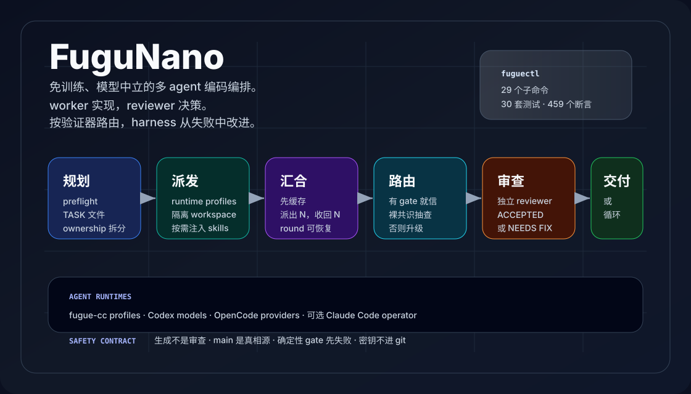
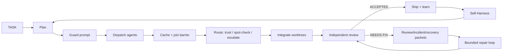

<div align="center">

[](README.md) &nbsp; [](README.zh-CN.md)

# FuguNano

### Sakana Fugu 的开放轻量重实现

### 面向多 agent 软件工程的证据门控 Evo Engineering

<p align="center">
  = 18.18" />
  
  
  
  <a href="https://github.com/BicaMindLabs/FuguNano/actions/workflows/ci.yml"></a>
  
</p>

<p align="center">
  <a href="#快速开始">快速开始</a> |
  <a href="#工作流">工作流</a> |
  <a href="#验证器感知路由">路由</a> |
  <a href="#命令面">命令面</a> |
  <a href="docs/WORKFLOW.md">完整流程</a> |
  <a href="docs/SELF_HARNESS.md">Self-Harness</a> |
  <a href="docs/PARITY.md">参考与对齐</a>
</p>



</div>

FuguNano 是一个轻量、免训练的多 agent 编码控制面。它不训练 coordinator —— 而是把
你已有的 agent 组织成一条可审计的闭环:规划、派发、汇合、审查、修复、学习,并让
harness 自己继续改进。每一步都由确定性证据支撑,而不是模型的自然语言总结。

## 为什么需要 FuguNano

| 问题                               | FuguNano 的回答                                       |
| ---------------------------------- | ----------------------------------------------------- |
| 前沿模型或硬件路径越来越难稳定依赖 | 协调多个可用模型,而不是押注单一路线。                |
| 多 agent 输出容易丢                | dispatch 可落盘;每轮都有 join barrier。              |
| Review 变成长段自然语言            | review / incident / recovery / guard 都有 packet。    |
| Agent loop 容易空转                | 修复 loop 有边界、有状态,并由独立 reviewer 审查。    |
| Prompt/runtime 风险不可见          | guard packet 和 action certificate 留下本地证据。     |
| 一次经验用完就消失                 | experience memory 和进化 loop 会把经验喂回闭环。      |
| fan-out 的结果被无脑采信           | Selector 给每次 fan-out 定路由:有 gate 背书就信,裸共识只抽查,其余升级。 |

## 工作流

一条很短的流水线,每一跳都由下文的 packet 把守:



日常入口刻意保持很短:

```bash
fuguectl preflight --harness lite
fuguectl preflight --harness codex
fuguectl preflight --harness opencode --target opencode/deepseek-v4-flash-free
fuguectl preflight --harness agy
fuguectl preflight --harness fugue-cc

fuguectl task new "implement feature"
fuguectl plan "implement feature" --harness lite --models a,b --out /tmp/fugunano-plan --timeout-ms 120000 --allow-partial --codex-clean --harness-arg x --codex-arg x --opencode-arg x --agy-arg x --task TASK.md
fuguectl guard prompt /tmp/prompt.md --source-ref TASK.md
fuguectl dispatch cc-deepseek --template impl --task TASK.md --task-type backend
fuguectl cache barrier 1
fuguectl route --round 1 --gate ./run-tests.sh   # exit 0 TRUST / 10 SPOT_CHECK / 20 ESCALATE
fuguectl integrate --work /path/to/project --agents "cc-deepseek cc-kimi"
fuguectl review packet /tmp/review.txt --json
fuguectl incident packet /tmp/failure.log --json
fuguectl incident recovery /tmp/failure.log --json
fuguectl loop record --verdict NEEDS_FIX --round 1
fuguectl loop decide
```

`fuguectl smoke --harness all --codex-clean --timeout-ms 120000 --task TASK.md
--out-dir /tmp/fugunano-smoke` 会写入带
`status`/`passed`/`failed`/`exitCode` 的 `summary.json`。

`fuguectl plan ...` 会写入 `<out>/summary.json`,字段为
`status`/`exitCode`/`allowPartial`/`succeeded`/`available`/`failed`,不用翻模型聊天记录也能检查规划结果。

## 快速开始

要求:macOS 或 Linux、Node.js >= 18.18、`git`、`tmux`,以及你选择使用的模型凭证。
推荐用 Codex 做独立 review。

```bash
git clone https://github.com/BicaMindLabs/FuguNano fugunano
cd fugunano

/path/to/fugunano/orchestration/fuguectl/fuguectl help quickstart
/path/to/fugunano/orchestration/fuguectl/fuguectl init --dry-run
make doctor
make install
make verify
make ci-clean
```

真实 key 不进仓:

```bash
mkdir -p ~/.config
$EDITOR ~/.config/cc-model-secrets.env
```

可选的 `fugue-cc` worktree fleet:

```bash
cp orchestration/fugue-cc/provider.config.example /path/to/project/.fugue-cc/provider.config
cd /path/to/project
fugue-cc

/path/to/fugunano/orchestration/fuguectl/fuguectl preflight --harness fugue-cc
/path/to/fugunano/orchestration/fuguectl/fuguectl fleet status
```

安装 operator skill:

```bash
make install-skill
~/.claude/skills/fugunano/fuguectl selftest
```

这个 skill 对 Claude Code 很方便,但 workflow 不绑定 Claude Code。Codex、OpenCode、
Antigravity 和未来 agent 都走同一套 agent profiles。前端/UI 任务可以用
`agy --prompt "..."`,review 仍然应保持独立。

## 证据包

这条闭环不靠自然语言运转,而是靠类型化的 packet。每个 packet 都是确定性
TypeScript,既把守上面流水线里的一跳,又成为下面进化 loop 的燃料。

| Packet                   | 命令                              | 用途                                                |
| ------------------------ | --------------------------------- | --------------------------------------------------- |
| Task handoff             | `fuguectl task handoff`           | 把任务契约和近期证据交给下一个 agent。              |
| Task digest              | `fuguectl task digest`            | 把长 TASK 压成有界 prompt card。                    |
| Review packet            | `fuguectl review packet`          | 把 review 文本转成 finding 和 check。               |
| Incident packet          | `fuguectl incident packet`        | 给失败 trace 标原因、层级和证据。                   |
| Incident recovery packet | `fuguectl incident recovery`      | 输出 containment / repair / validation / learning。 |
| Runtime guard packet     | `fuguectl guard prompt`           | dispatch 前拦截高风险 prompt。                      |
| Action certificate       | `fuguectl dispatch --certificate` | 给 runtime action 留证明侧车。                      |

## 智能体运行时契约

<p align="center">
  
</p>

核心只认一个 `Harness` 端口（`dispatch(req) → Result`、`health()`），所以新增 agent
永远不碰编排逻辑。四个核心 harness（`fugue-cc|codex|opencode|agy`）留在默认面;实验性
运行时选择性接入,且不进 `preflight --all`。

| 层级   | 运行时                                                        | 怎么接入                                                              |
| ------ | ------------------------------------------------------------ | -------------------------------------------------------------------- |
| 核心   | `fugue-cc` · `codex` · `opencode` · `agy`                    | 默认面里的 descriptor 化 adapter                                     |
| 实验性 | `agent-cli`（qwen-code · kimi-code · mimo-code · trae · qoder） | registry 里每个 agent 一条 `InvocationDescriptor`,不新增 `HarnessName` |
| 实验性 | `acp-agent`                                                  | 协议 adapter（`initialize → prompt → result`），刻意不用 descriptor   |

新增 agent = 一条 registry 条目 + preflight 探针 + smoke,不是改核心。每个 harness
满足同一个端口,自动继承 guard 与 certificate 门。

## 验证器感知路由

给一堆便宜模型 fan-out,效果好不好取决于它背后有没有验证。`Selector`
（`engine/src/domain/selector.ts`）是一个纯 domain 路由器,决定如何处理 best-of-N
fan-out 的结果:`TRUST`(有验证器背书某个结果)、`TRUST_SPOT_CHECK`(fleet 一致但
无人验证)、`ESCALATE`(交给 premium 模型)。规则由基准实测得出,不是拍脑袋:

- **有便宜验证器**(单测 / 参考解)时,best-of-N 近乎免费 —— gate 自动挑出通过者。
  一队小模型在 100 道可判定算法题上追平了 premium 单模;在更难的 14 题集上再次成立
  (小模型单飞只有 ~11/14,gate 把合奏抬到 14/14,与最强 premium 持平)。在真实
  SWE-bench-lite 实例上,同一条可执行-gate 流水线端到端解决 issue,全程无任何
  LLM 裁判([benchmarks/case-swebench](benchmarks/case-swebench/))。
- **没有验证器时,一致性是唯一信号,而它会“相关性失灵”。** 在安全、不可能要求、
  隐蔽正确性这类坑上,整队小模型往往一起栽进同一个坑,此时共识是“自信的错误”。
  这些类别直接升级;未验证的共识永远不是干净的 `TRUST`,只是 `TRUST_SPOT_CHECK`。
  置信度做 Laplace 平滑,5/5 读作 0.86 而非确定;升级按分歧度排序,让 premium
  预算优先花在最不确定的任务上。
- **skeptic playbook**（[templates/skeptic.md](orchestration/fuguectl/templates/skeptic.md)）
  前置注入从已知坑蒸馏出的“类别级怀疑规则”。在一组没见过的 held-out 新坑上,它把
  小模型的避坑率从 59% 抬到 84%,零回退 —— 规则能泛化,因为它针对类别而非背题。

每个机制都对应一篇论文(EDV、Agentic Abstention、OmniOPD、SkillHarness)。路由器
本身与验证器无关:任务能便宜产出什么 `verified`/`label` 信号,它就吃什么 —— 这正是
“验证器阶梯”:真值 gate → 合成 gate → skeptic → 裁判 → 共识 → 升级。

同一条定律也约束着 review loop 本身:在一个“正确行为无法从任何合法信号观测到”
的 SWE-bench 实例上(issue 原文本身就语义两可),single-shot、盲审 review-loop、
合法信号 loop(repro + 回归检查)三种方式全部同样失败。
**编排能买到的,恰好等于你能观测到的信号。**

## 证据门控进化

<p align="center">
  
</p>

FuguNano 把运行时证据当成工程闭环的入口,而不是报告的终点。Packet 会变成弱点信号;
对工程面的候选修改会在固定 held-in/held-out cases 上评分;只有非回退的修改才会被
晋升并写入可审计 lineage。`guard-rule` 这样的安全面永远只能由 operator 晋升 ——
agent 永远无法悄悄放宽自己的护栏。

Dogfood fixture：[.fugunano/evolution/evo-guard-rule-tighten-gh-release-certificate.json](.fugunano/evolution/evo-guard-rule-tighten-gh-release-certificate.json)
记录了一次真实的 guard-rule 晋升,用来补上缺失 action-certificate 检查的路径。

Self-Harness 是这条 loop 的第一个后端 —— 它进化 harness 配置面(system prompt、
memory、skills……):

<p align="center">
  
</p>

它会挖 verifier-grounded failure,提出有边界的修改,并只 promote 不回退的改动。
操作说明见 [docs/SELF_HARNESS.md](docs/SELF_HARNESS.md)。

## 命令面

`orchestration/fuguectl/fuguectl` 是生产入口:29 个子命令、30 套测试、434 个 wrapper 断言。

| 区域          | 命令                                                                                                                                                                                                                                                                                                                         |
| ------------- | ---------------------------------------------------------------------------------------------------------------------------------------------------------------------------------------------------------------------------------------------------------------------------------------------------------------------------- |
| Setup         | `fuguectl doctor`、`fuguectl init --dry-run\|--write`、`fuguectl version`、`fuguectl preflight --harness fugue-cc\|codex\|opencode\|agy\|lite\|all`、`fuguectl smoke`、`fuguectl fleet status\|up\|down`                                                                                                                     |
| Planning      | `fuguectl task new\|log\|done\|handoff\|digest`、`fuguectl template <name>`、`fuguectl plan "<goal>" [--harness h\|lite] [--models a,b] [--out dir] [--timeout-ms n] [--allow-partial] [--codex-clean] [--harness-arg x] [--codex-arg x] [--opencode-arg x] [--agy-arg x] [--task f]`、`fuguectl goal template\|show\|check` |
| Routing       | `fuguectl allocate <type>`、`fuguectl route [<file>\|-\|--round n [--gate cmd]] [--category c] [--threshold n] [--forced a,b] [--task f]`、`fuguectl workspace list\|show\|model\|context`、`fuguectl agents template\|validate\|list\|resolve`、`fuguectl skills index\|list\|match\|show\|inject\|validate\|forge`                                            |
| Dispatch      | `fuguectl guard prompt <file\|->`、`fuguectl dispatch <target> [--certificate <file>] [--skeptic]`、`fuguectl cache init\|put\|fail\|barrier\|collect\|resume`                                                                                                                                                                           |
| Review/Repair | `fuguectl integrate --work <repo>`、`fuguectl review packet <file\|->`、`fuguectl incident packet\|recovery <file\|->`、`fuguectl loop init\|record\|decide\|status`、`fuguectl run set\|round\|status\|next\|clear`、`fuguectl summary <round>`                                                                             |
| Memory/Evolve | `fuguectl experience add\|audit\|eval\|learn\|list\|policy\|promote\|recall\|show`、`fuguectl evolve mine\|validate\|promote\|history`、`fuguectl self-harness template\|run`、`fuguectl runtime check\|adapt`、`fuguectl selftest`                                                                                          |

## 桌面 GUI(FuguNano Studio)

一个源码完整的 Electron + React 桌面应用,给这套闭环一张脸——看一次 fan-out
跑起来、实时看到[验证器感知路由](#验证器感知路由)的判决、读到 benchmark 证据。
它通过对 `fuguectl` 做 `execFile` 经防注入 IPC 桥接与引擎通信——不走 HTTP、不走 shell。

| 视图           | 展示什么                                                                                 |
| -------------- | ---------------------------------------------------------------------------------------- |
| **Pipeline**   | 操作台:plan → dispatch → integrate → review → loop,附实时 agent 健康。                  |
| **Rounds**     | 对磁盘上 cache round 的只读监控——每个 agent 的 done / fail / pending。                    |
| **Selector**   | 路由决策可视化:`TRUST` / `TRUST_SPOT_CHECK` / `ESCALATE` 配置信度环。实时预览逐行镜像引擎的 `route()`。 |
| **Benchmarks** | 用条形讲结论:有验证器时 fan-out 追平 premium,没有时打回。                               |

```bash
make gui-install   # 一次性:安装桌面依赖
make gui           # 启动 FuguNano Studio(Electron,dev 模式)
```

位于 [`benchmarks/case-d-gui/desktop`](benchmarks/case-d-gui/desktop);逐视图说明与数据来源见
[docs/GUI.md](docs/GUI.md)。CI 在每次 push 时 typecheck 并构建 renderer。

## Fugu、OpenFugu、FuguNano

<p align="center">
  
</p>

| 系统        | 协调层放在哪里             | 最适合什么                                  |
| ----------- | -------------------------- | ------------------------------------------- |
| Sakana Fugu | API 背后的训练式 conductor | 托管式多模型合成。                          |
| OpenFugu    | 开放训练与服务栈           | 重建和研究 conductor 路线。                 |
| FuguNano    | 仓库原生工程闭环           | 免训练的编排、审查、修复和 harness 自改进。 |

FuguNano 是这条路线上的轻量开放入口:先用策略、端口、审查门、证据包和 harness 自改进把协作跑起来,
再判断是否值得训练一个 conductor。

## 文档地图

| 你想看什么               | 文件                                           |
| ------------------------ | ---------------------------------------------- |
| Agent profile 与 runtime | [docs/AGENT_RUNTIME.md](docs/AGENT_RUNTIME.md) |
| 完整 workflow            | [docs/WORKFLOW.md](docs/WORKFLOW.md)           |
| 架构和 ports/adapters    | [docs/ARCHITECTURE.md](docs/ARCHITECTURE.md)   |
| Self-Harness             | [docs/SELF_HARNESS.md](docs/SELF_HARNESS.md)   |
| 桌面 GUI(FuguNano Studio) | [docs/GUI.md](docs/GUI.md)                    |
| 对齐关系和参考来源       | [docs/PARITY.md](docs/PARITY.md)               |
| 集成说明                 | [docs/INTEGRATIONS.md](docs/INTEGRATIONS.md)   |
| Agent 协作约定           | [AGENTS.md](AGENTS.md)                         |

## 开发

```bash
npm run scan
npm run lint:launchers
npm run check:docs
npm run test:fuguectl
cd engine && npm run check && npm run build
npm run ci
```

engine 是 strict TypeScript + ports/adapters。Shell 尽量只做薄启动器;新的稳定能力应该进 `engine/`。

## 致谢

FuguNano 借鉴了 Sakana AI Fugu、OpenFugu、上海 AI Lab Self-Harness、
Codex/Claude/OpenCode runtime tooling,以及 agent review、provenance、incident response、
memory 和 prompt safety 方向的研究。完整参考见 [NOTICE](NOTICE) 和 [docs/PARITY.md](docs/PARITY.md)。

## 安全

不要提交真实 key。本地 secret 放到 `~/.config/cc-model-secrets.env`。安全问题请私下报告。

## 许可

Apache-2.0。见 [LICENSE](LICENSE)。
